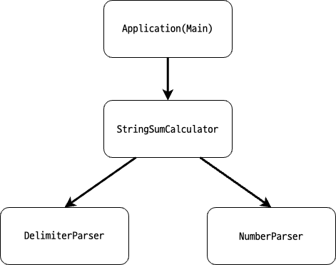

# **🧮 문자열 계산기**

## ✅ 문제 요구사항

### **1. 쉼표(,) 콜론(:) 구분자**

- 구분자가 쉼표(,) 또는 콜론(:)인 경우, 해당 구분자를 기준으로 분리한 각 숫자의 합을 반환해야 한다.
- 이때 숫자는 양수이어야 한다.

### **2. 커스텀 구분자**

- 쉼표, 콜론 외에도 커스텀 구분자를 사용할 수 있어야 한다.
- 커스텀 구분자는 문자열 앞 부분의 "//"와 "\n" 사이에 위치한다.

### **3. 예외 처리**

- 사용자가 잘못된 값을 입력할 경우 `IllegalArgumentException`이 발생하며 애플리케이션이 종료돼야 한다.
    
    **⚠️ 예외 상황**
  1. 지정된 구분자(콤마, 콜론, 커스텀 구분자)가 아닌 다른 구분자가 들어오는 경우
  2. 숫자가 누락된 경우 (예: 1::2 / 1:2:)
  2. 숫자가 음수가 들어오는 경우
  3. 커스텀 구분자가 숫자인 경우
  4. 숫자가 오버플로우가 나는 경우
     - 피연산자가 오버플로우 나는 경우
     - 계산 결과가 오버플로우 나는 경우
  5. ~~커스텀 구분자로 마침표(.)이 들어오는 경우 (숫자가 실수 일수도 있음)~~

### **⎡ Edge Case**

- 빈문자열이 들어오는 경우: 0

## 구현한 클래스

